# 🏃 Pacer 쉽게 이해하기

> 이 문서는 **중학생도 이해할 수 있게** Pacer라는 프로그램이
> 어떻게 만들어졌고, 어떻게 돌아가는지 그림(다이어그램)으로 설명합니다.
> 프로그래밍을 모르는 사람도 끝까지 읽으면 "아, 이렇게 생겼구나" 하고 감이 옵니다.

---

## 1. Pacer가 뭐예요?

**Pacer(페이서)** 는 고등학생과 학부모가 **시험 점수로 "나 어느 대학 갈 수 있어?"** 를
계속 추적하게 도와주는 **웹사이트(앱처럼 쓰는 PWA)** 입니다.

한국 입시는 한 번의 시험으로 끝나지 않아요. 1년 동안 시험을 **세 번** 봅니다:

```
6월 모의고사  ──▶  9월 모의고사  ──▶  수능(진짜 시험)
   (6모)            (9모)            (csat)
```

Pacer는 이 **세 시험을 하나의 흐름(타임라인)** 으로 보고,
점수가 오르내릴 때마다 **"지금 너의 위치"** 와 **"앞으로 전략"** 을 AI가 글로 설명해 줍니다.

> ⚠️ 중요한 약속: Pacer는 **"넌 무조건 합격!" 같은 말을 절대 하지 않습니다.**
> 대신 *"왜 그런지 이유를 설명"* 하고, 다른 입시 사이트(진학사 등)와 *비교*해서
> 얼마나 확실한지 알려줍니다. (이걸 코드가 강제로 막아둡니다 — 뒤에서 설명!)

---

## 2. 큰 그림: 누가 누구랑 일하나?

Pacer는 레고 블록처럼 **여러 개의 작은 부품(패키지)** 을 조립해서 만들었어요.
이렇게 나누면 한 부품을 고쳐도 다른 부품이 안 망가집니다.

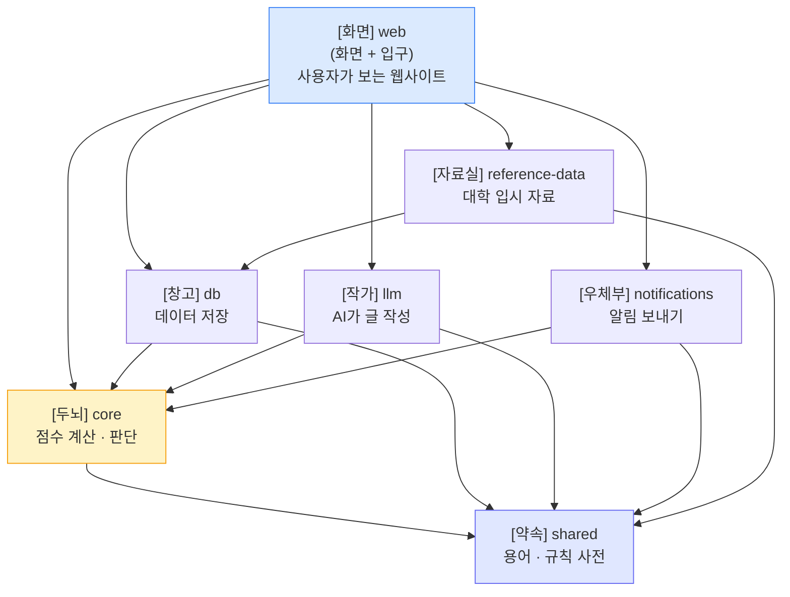

### 부품들을 사람으로 비유하면

| 부품 | 별명 | 하는 일 |
|------|------|---------|
| **web** | 가게 점원 | 손님(사용자)을 직접 만나는 화면. 주문을 받아 뒤로 넘김 |
| **core** | 두뇌 | 점수를 계산하고 "안정/적정/위험" 판단을 내림 |
| **db** | 창고 관리인 | 점수·결과를 데이터베이스에 저장하고 꺼내옴 |
| **llm** | 작가 | 두뇌가 계산한 결과를 보고 **사람이 읽을 글**을 씀 (AI) |
| **notifications** | 우체부 | "9월 모의고사 봤어요?" 같은 알림을 카톡·이메일로 보냄 |
| **reference-data** | 사서 | 전국 대학들의 입시 자료를 모으고 정리 |
| **shared** | 규칙 사전 | 모두가 똑같은 용어를 쓰도록 정해둔 공통 약속 |

### 화살표 방향에는 규칙이 있어요 (중요!)

화살표는 **"누가 누구에게 일을 시키는가(의존한다)"** 를 뜻합니다.
규칙은 **"항상 안쪽(두뇌·약속)을 향한다"** 입니다.

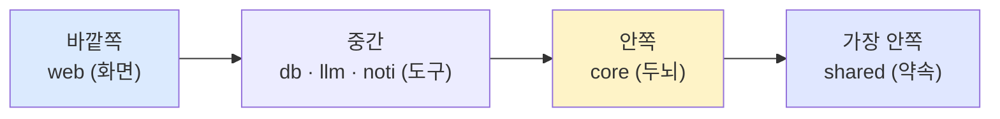

- 🧠 **두뇌(core)** 는 "화면이 어떻게 생겼는지", "데이터를 어디에 저장하는지" **전혀 몰라도 됩니다.**
  오로지 "점수 계산"에만 집중해요.
- 덕분에 나중에 창고(db)를 다른 걸로 바꿔도 두뇌는 그대로 쓸 수 있습니다.

> 💡 이런 설계를 어려운 말로 **"헥사고날 아키텍처"** 또는 **"포트와 어댑터"** 라고 불러요.
> 쉽게 말하면 **"두뇌는 깨끗하게, 지저분한 일은 바깥에서"** 라는 원칙입니다.

---

## 3. 데이터는 어떻게 생겼나? (입시 사이클이 중심!)

Pacer의 모든 데이터는 **AdmissionCycle(입시 사이클)** 이라는 하나의 뿌리에서 가지처럼 뻗어 나옵니다.
"한 학생의 한 해 입시 도전"을 통째로 담는 상자라고 생각하세요.

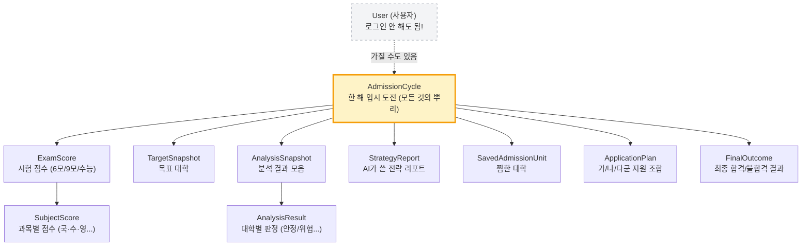

### 왜 User가 아니라 Cycle이 중심일까?

보통 앱은 "사용자"가 중심인데, Pacer는 다릅니다.
**처음 들어온 사람은 회원가입을 안 해도 바로 점수를 넣고 결과를 봅니다.**
(그림에서 User가 점선인 이유 — "있어도 되고 없어도 됨")

> 💡 회원가입이라는 **문턱을 없애서** 누구나 부담 없이 써보게 만든 거예요.
> 나중에 마음에 들면 그때 가입하면 됩니다.

### 옆에는 "참고 자료" 테이블이 따로 있어요

학생 데이터와 별개로, **관리자가 정리한 대학 정보** 가 있습니다:

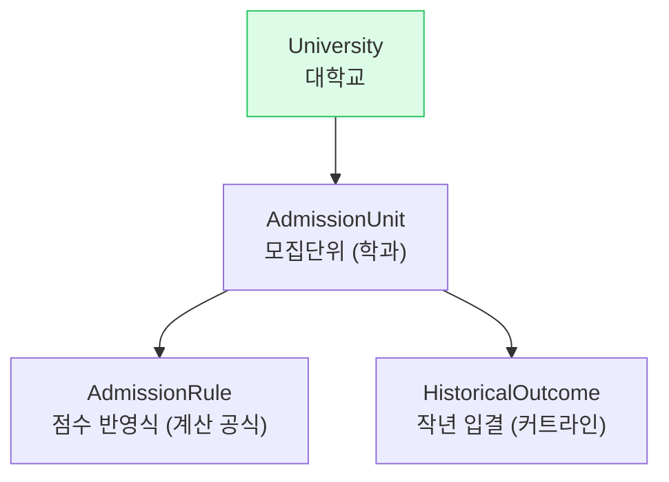

이 자료는 **두뇌(core)가 "이 학생 점수면 이 학과는 안정권"** 이라고
판단할 때 쓰는 **기준표** 입니다.

---

## 4. 점수를 넣으면 무슨 일이 벌어지나? (핵심 흐름!)

이게 Pacer에서 **가장 중요한 부분** 입니다. 천천히 따라가 봅시다.
학생이 점수를 넣고 "리포트 만들어줘" 버튼을 누르면:

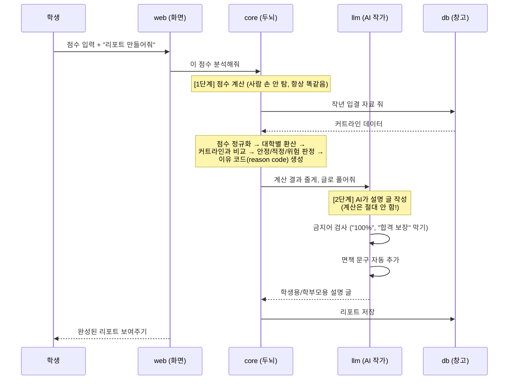

### 두 단계로 나뉜다는 게 핵심!

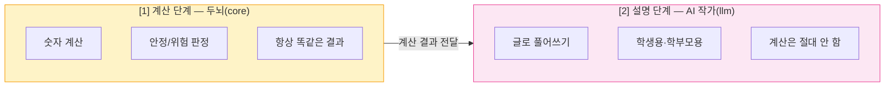

> 💡 **왜 굳이 나눴을까요?**
> AI(작가)는 가끔 틀린 숫자를 지어냅니다("환각"이라고 해요).
> 그래서 **계산은 믿을 수 있는 두뇌에게만 맡기고, AI는 글쓰기만** 하게 했어요.
> AI는 두뇌가 준 결과를 **벗어나는 말을 못 하도록** 코드가 검사까지 합니다.

---

## 5. AI가 거짓말 못 하게 막는 장치 (안전 필터)

Pacer는 AI가 위험하거나 과장된 말을 하지 못하게 **여러 겹의 검문소** 를 둡니다.
이걸 담당하는 게 **LLM Gateway(게이트웨이 = 검문소)** 입니다.

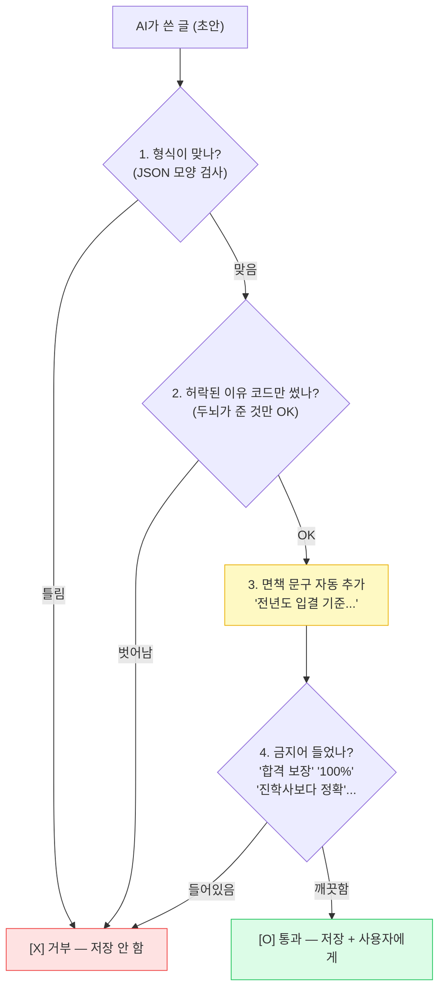

이 검문소를 통과하지 못한 글은 **사용자에게 보여지지도, 저장되지도 않습니다.**
덕분에 "interpretation over prediction(예측이 아닌 해석)" 이라는 약속이 지켜집니다.

---

## 6. 알림은 어떻게 보내나? (우체부의 우선순위)

입시는 6모로 끝이 아니에요. **9월·수능 때 학생을 다시 불러오는 알림** 이 Pacer의 핵심입니다.
그런데 알림 방법이 하나만 있으면 위험해요. 그래서 **3가지 방법을 순서대로** 시도합니다.

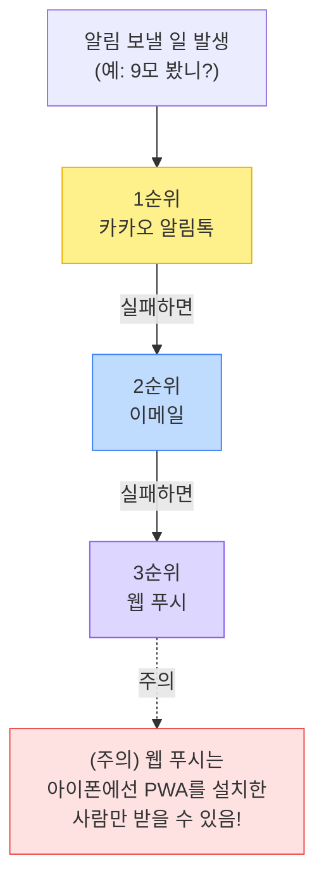

> 💡 아이폰은 웹 푸시 제약이 심해서(설치 안 한 사람은 못 받음),
> 카톡·이메일이 **반드시 받쳐줘야** 모두에게 알림이 닿습니다.

---

## 7. 컴퓨터에서 어떻게 실행하나? (개발자용 명령어)

이 프로젝트는 **pnpm + Turborepo** 라는 도구로 여러 부품을 한 번에 관리합니다.
터미널에 아래처럼 입력해서 작동시킵니다:

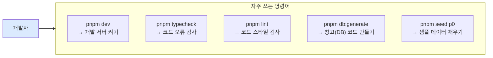

| 명령어 | 뜻 (쉽게) |
|--------|-----------|
| `pnpm dev` | 사이트를 내 컴퓨터에서 켜서 직접 써보기 |
| `pnpm build` | 진짜 배포용으로 완성품 만들기 |
| `pnpm typecheck` | "코드에 실수 없나?" 자동 검사 |
| `pnpm lint` | "코드를 깔끔하게 썼나?" 자동 검사 |
| `pnpm db:migrate` | 창고(데이터베이스) 구조 바꾸기 |

> 💡 **Turborepo** 는 여러 부품을 동시에·빠르게 처리해주는 "작업 반장"이에요.
> 한 번 검사한 건 기억해뒀다가(캐시) 다음엔 건너뛰어서 빠릅니다.

---

## 8. 단계별로 만들어 나가는 중 (로드맵)

Pacer는 한 번에 다 만드는 게 아니라 **시험 일정에 맞춰** 단계적으로 키웁니다.

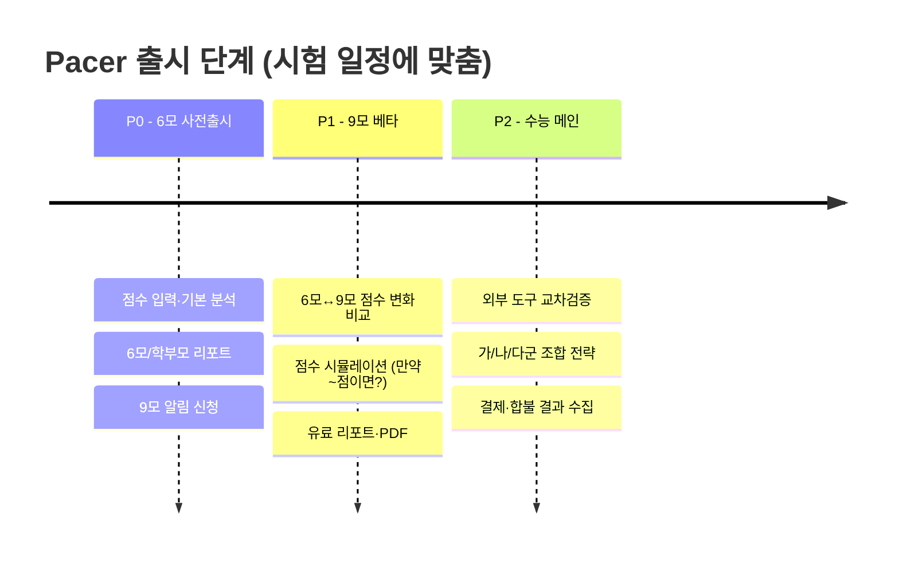

> 💡 핵심 원칙: **6모 때 만든 건 9모·수능에서 그대로 재사용** 합니다.
> 한 번 쓰고 버리는 코드를 만들지 않아요.

---

## 9. 한 장 요약

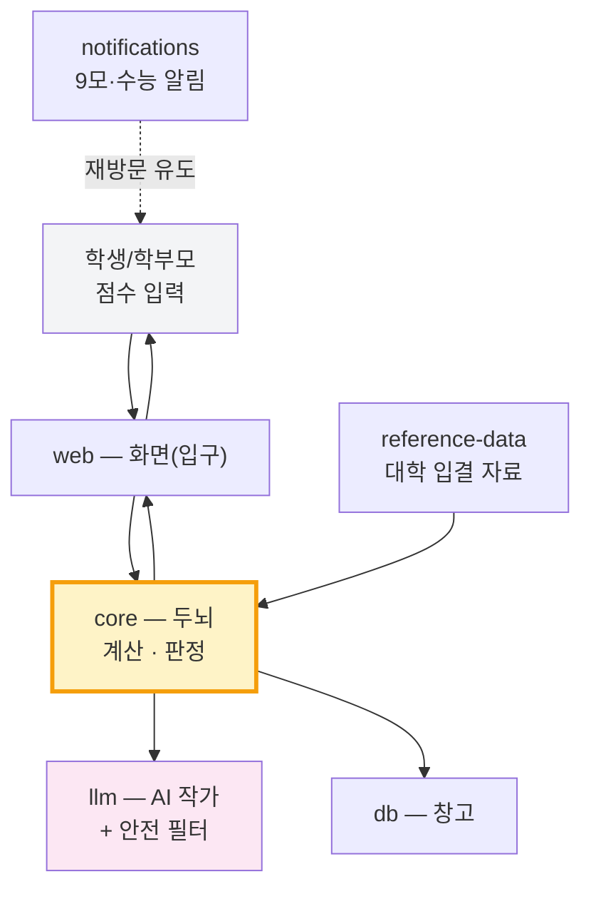

**세 줄 정리:**
1. Pacer는 **6모→9모→수능** 한 해 입시를 통째로 추적하는 웹사이트다.
2. **두뇌(core)가 계산** 하고 **AI(llm)가 설명 글** 을 쓰되, AI는 과장·거짓말을 못 하게 막혀 있다.
3. 부품(패키지)을 깔끔하게 나눠서 **한 곳을 고쳐도 다른 곳이 안 망가지게** 설계했다.

---

## 📂 더 깊이 알고 싶다면

| 궁금한 것 | 볼 파일 |
|-----------|---------|
| 전체 설계 원칙 | `docs/01-architecture.md` |
| 제품 기획서(진짜 원본) | `PRODUCT_SPEC.md` |
| P0 구현 보고서 | `docs/03-p0-implementation-report.md` |
| P1/P2 백엔드 | `docs/04-p1-p2-foundation.md` |
| 데이터 모양(DB) | `packages/db/prisma/schema.prisma` |
| 공통 용어 사전 | `packages/shared/src/enums.ts` |
| 두뇌(계산 엔진) | `packages/core/src/engine/` |
| AI 검문소 | `packages/llm/src/gateway.ts` |

> 이 그림들은 GitHub, VS Code, Obsidian 등에서 **Mermaid** 를 지원하면 자동으로 그려집니다.
> 안 그려지면 [mermaid.live](https://mermaid.live) 에 코드를 붙여넣어 보세요.
