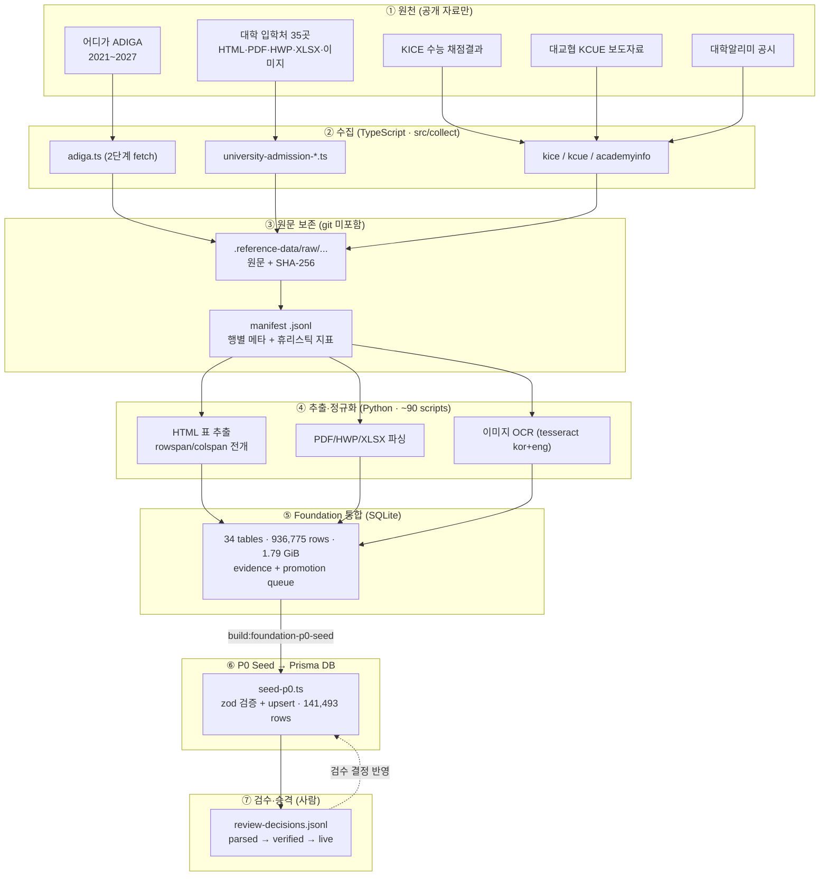

# Pacer 레퍼런스 데이터 현황 — 단일 출처

> 이 문서는 **2026-06-17 품질 보고서**와 **2026-06-20 수집 보고서**를 대체한다(둘 다 여기에 통합됨).
> 범위: `packages/reference-data`의 공개 산출물, foundation SQLite, P0 seed. 사용자 실측 성적·결제·합불 데이터는 포함하지 않는다.

---

## 1. 한 줄 결론

**수집은 사실상 완료(2027 입결 공개만 대기), 데이터 수준은 "검수 대기 단계의 운영 후보"** 다. 수집량·출처 추적성·무결성은 우수하지만, 전형규칙은 전부 `parsed`이고 입결 신뢰도도 medium 이하가 다수라 아직 "검증 완료 데이터"가 아니다. 남은 병목은 추가 수집이 아니라 **검수·승격·canonical mapping**이다.

---

## 2. 스코어카드 (단일 정규 표 · 2026-06-20 최신값 기준)

| 항목 | 값 | 판정 |
| --- | ---: | --- |
| 대학 universe | 215 | 전국 단위 확보 |
| 대학-학년도 셀 | 1,505 | 215개 대학 × 2021~2027 전 셀 enumerate |
| review-ready 이상 셀 | 1,493/1,505 (99.2%) | 검수 착수 가능권 |
| source-rich 셀 | 1,256/1,505 (83.5%) | 원천·후보 풍부 |
| 2021~2026 source-rich 셀 | 1,234/1,290 (95.7%) | 과거 입결 구간 우수 |
| source gap | 1셀 | 실질 공백 거의 없음 |
| Foundation SQLite | 34 tables / 936,775 rows / 1.79 GiB · integrity `ok` | 통합 검수 DB |
| 공개 산출물 파일 | 74,501개 / 약 23.1 GiB | 텍스트 29,935 · PNG 17,207 · JSON 11,898 · CSV 9,331 · JSONL 6,112 |
| P0 seed | 141,493 rows · audit `ok`(위반 0) | Prisma 적재 완료 |
| University | 215 | 대학 universe |
| AdmissionUnit | 68,072 | 연도별 모집단위 |
| AdmissionRule | 4,868 | **전부 2027 `parsed` draft** |
| HistoricalOutcome | 68,338 | 2021~2026 (2027 제외 — 공개 대기) |
| 입결 confidence | medium 26,826(39.3%) / low 6,162(9.0%) / limited 35,350(51.7%) | low+limited 60.7% — 보수화 필수 |
| 남은 gap queue | 560 rows | 전부 2027 `wait_for_public_release` |

P0 seed 무결성 감사(2026-06-19): FK 누락 0, 2027 입결 혼입 0, sourceUrl 없는 행 0, `needsHumanVerification` 누락 0, `parsed` 외 전형규칙 0.

---

## 3. 수집 아키텍처



**2-언어 파이프라인**: TypeScript는 수집·시드, Python(~90 스크립트)은 파싱·정규화·foundation 구축.

**설계 원칙 3가지**: ① 출처 보존(모든 행에 `sourceUrl` + 로컬 원문 + `sha256` + 수집시각, 원문 없는 값 없음) · ② 검수 전 = 미검증(`parsed`는 "운영 후보"일 뿐 라이브 데이터 아님) · ③ 자동수집 금지 영역(경쟁사 도구 결과는 절대 자동수집 안 함, §7.7.4).

**수집 볼륨 요약**: 어디가 7개년 × 220대학 = 1,540 상세 HTML(fetch 실패 0) · HTML 표 36,586개 · 정시 입결 표 1,421개 / 후보 36,373행 · 고유 이미지 839 URL → 837 다운로드(실패 0) · OCR 837건 처리(757건 텍스트 보유) · 원천 카탈로그 42개 원천.

---

## 4. 품질

### ✅ 강점

- **출처 추적성 100%**: 모든 rule/outcome에 `sourceUrl` + 원문 + SHA-256 보존
- **참조 무결성 위반 0건**, 자동수집 잔여 큐 0
- **과거 입결 커버리지**: 2021~2026 source-rich 95.7%
- **공개대기 분리**: 남은 560 gap 전부 2027 `wait_for_public_release`

### ⚠️ 주의점 (그래서 "최종 데이터"가 아님)

| 리스크 | 현황 | 영향 |
| --- | --- | --- |
| 전형규칙 검수 미완료 | 4,868행 100% `parsed` | 환산식을 `verified/live`처럼 단정 금지 |
| 입결 confidence | low+limited 60.7% | 강한 합격 가능성 표현 금지, band 보수화 유지 |
| 모집단위 canonical mapping | 후보 많으나 동명/캠퍼스/학과 변동 검수 필요 | 연도별 비교·지원군 조합 정확도에 영향 |
| OCR 품질 | 837건 중 일부 텍스트 추출 실패 | 이미지 표는 사람 검수 보조로만 사용 |
| 2027 입결 미공개 | seed에서 제외 | 정상 상태, release monitor 필요 |
| 사용자 실측 합불 | 출시 전, 수집 대상 아님 | `FinalOutcome` 데이터 해자는 아직 시작 전 |

### 입결 필드별 품질 (`historical_outcomes.csv`, 68,338행 = 100%)

| 항목 | 행 수 | 비율 |
| --- | ---: | ---: |
| 점수 필드 1개 이상 보유 | 54,314 | 79.5% |
| 경쟁률 보유 | 66,939 | 98.0% |
| 충원합격 보유 | 48,487 | 71.0% |

경쟁률·모집 정보는 넓게 확보됐으나 점수 기반 분석은 row별 편차가 크다.

### 전형규칙 필드별 품질 (`admission_rules.csv`, 4,868행 = 100%)

`verifiedStatus=parsed` 100% · source URL 보유 100% · `needsHumanVerification=true` 100%.

> 🔑 **핵심 발견**: 4,868개 규칙은 가중치 컬럼(국/수/탐 weight, totalScale)이 **비어있고** 정책 JSON이 placeholder라, 엔진이 요구하는 `{mode, byGrade}` 형식이 아니다. 즉 `verifiedStatus`만 `verified`로 토글해도 환산이 풀리지 않는다 — 검수는 단순 승인이 아니라 **원문을 보고 가중치·정책표를 엔진 형식으로 입력하는 데이터 작업**이다.

---

## 5. 지금 데이터로 할 수 있는 것 / 없는 것

### 지금 가능한 것

- P0 내부 데모·QA용 seed로 사용
- 대학·모집단위·입결 후보 기반 관리자 검수 워크플로 시작
- 6모/9모/수능 분석 엔진의 저신뢰·제한 케이스 테스트
- 2027 입결 공개 여부 release monitor 운영
- 출처 URL을 함께 보여주는 reference-data 검수 화면 제작

### 아직 하면 안 되는 것

- `parsed` 전형규칙을 검증 완료 환산식처럼 표시
- confidence `limited` 입결을 근거로 강한 합격 가능성 표현
- 어디가/입학처 원천 후보를 사람 검수 없이 production `live`로 승격
- 이미지 OCR 결과를 단독 근거로 사용
- 외부 도구 데이터를 자동 수집하는 파이프라인 추가

---

## 6. 남은 일 = 검수·승격·canonical-mapping (+ 2027 모니터링)

- **추가 수집은 없음** — 남은 560건 전부 2027 입결 `wait_for_public_release`. 자동수집 명령 반복 금지, 실제 공개 후에만 재개(`foundation_release_monitor_targets` 190개 기준).
- **parsed → verified → live 승격** — 트래픽 큰 핵심 대학·정시 주요 모집단위부터 `live` subset 구축(일괄 검수보다 우선순위 검수가 빠름).
- **가중치·정책표 엔진 형식 입력** — 검수 시 원문 기반으로 `{mode, byGrade}` 입력(단순 토글 아님).
- **모집단위 canonical mapping** — 동명/캠퍼스/학과명 변동 정리.
- **영어 ratio 후속** — `EnglishPolicy.mode:"ratio"` 추가로 90% 대학 비율반영 가능(820건 승격: verified 12 / parsed 808 / blocker 8). 우선순위 A(ratio 재작성 16개 대학), B(원문 직접 검수 23개 대학) 남음.
- **confidence 기반 노출 정책 확정** — `medium` 이상 일반 분석, `low/limited`는 제한 고지 + 보수적 band cap.
- **실제 합불 데이터 설계 연결** — 출시 후 `FinalOutcome` 수집 시작 시 Pacer 데이터 해자 형성.

> 상세 위임 절차: [03-remaining-work-protocol.md](03-remaining-work-protocol.md) · 검수 작업 가이드: [02-review-guide.md](02-review-guide.md)

---

### 부록: 검증 상태 사다리

```
draft → parsed → verified → live → deprecated
         ▲
         └─ 현재 모든 전형규칙(4,868)이 여기 머물러 있음
```

신뢰도 enum(`Confidence`): `high → medium → low → limited` — 현재 입결은 medium 이하가 60.7%.
